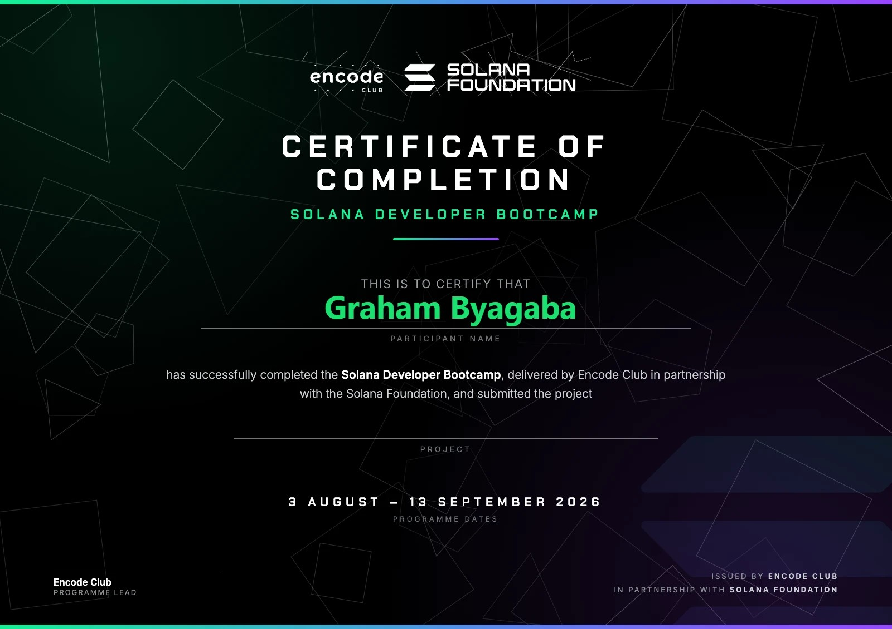

# solana-dev

Solana development workspace — Encode Solana Developer Course. Built with
Anchor, tested against LiteSVM (no validator needed: `cargo test`).

## 🎓 Certificate of Completion

Completed the **Solana Developer Bootcamp**, delivered by Encode Club in
partnership with the Solana Foundation (3 August – 13 September 2026).



## 🏁 Capstone: NFT Marketplace

**This is the course capstone submission** (Week 6, Project Option 2 — "List
and buy NFTs atomically"). Everything else in this repo is the weeks 2-5
coursework it was built from. See [`nft-marketplace/README.md`](nft-marketplace/README.md)
for the full write-up: architecture, runbook, and trade-offs.

| | |
|---|---|
| **Deployed program** | [`DPZVLmiip36N4TnJBghu7opiZTBx6C4LBH4j9WhRPEpN`](https://explorer.solana.com/address/DPZVLmiip36N4TnJBghu7opiZTBx6C4LBH4j9WhRPEpN?cluster=devnet) (devnet) |
| **Live app** | [solana-dev-frontend.vercel.app](https://solana-dev-frontend.vercel.app) ("Neon NFT Portal") |
| **Source** | [`nft-marketplace/`](nft-marketplace/) (program) · [`frontend/`](frontend/) (app) |
| **Tests** | 21 LiteSVM integration tests — happy paths and 13 failure paths |

Fixed-price listings (list / buy / cancel / update price) and timed English
auctions (create / bid with automatic outbid refunds / settle / cancel), NFTs
escrowed in PDA-owned token accounts, a configurable marketplace fee paid to
a PDA treasury. Combines PDA-based on-chain state and authority checks
(from `counter`/`voting`), SPL token operations (from `token-system`/
`week3-tokens`), CPI composability into the SPL Token program, and a working
frontend — the four building blocks the capstone brief asks for.

## Weekly coursework (building blocks)

The capstone above draws on the exercises below; each still builds and
tests independently.

### Week 2 exercises

| Exercise | Covers |
|----------|--------|
| [`voting/`](voting/) | Program **states** (Draft → Active → Closed), **failure tests** for every custom error, Token-2022 ballot token minted per vote |
| [`token-system/`](token-system/) | **Account-level token system**: manager PDA, **Token-2022** mint with the **TokenMetadata extension**, mint/transfer/burn/update-metadata, custom **error messages**, supply cap |
| [`counter/`](counter/) | **How Solana stores data**, **PDA concepts**, a counter that saves its value in a PDA, **loop-verified** tests, dev-tools checklist (see its [README](counter/README.md)) |

Each exercise builds with `anchor build` and tests with `cargo test` from
its own directory.

### Week 3 exercises

CLI-first this week: use the `spl-token` CLI to create/mint/inspect, then read
the same state back in TypeScript (`@solana/web3.js` + `@solana/spl-token`).
Runs against **devnet**. See [`week3-tokens/`](week3-tokens/).

| Exercise | Covers |
|----------|--------|
| [`exercise3-spl-token/`](week3-tokens/exercise3-spl-token/) | **Your First Token**: SPL mint, token accounts, mint supply, transfer between two wallets, then a TS reader (`supply == sender + recipient`) |
| [`exercise4-token2022/`](week3-tokens/exercise4-token2022/) | **Token-2022 extensions**: mint with **TransferFeeConfig** (observable 5% fee) + **Metadata**, then decode extension data straight off the mint account in TS |

### Week 4 exercises

State machines, cross-program invocation, and a wallet-connected frontend.

| Exercise | Covers |
|----------|--------|
| `voting/` (Exercise 5) | **Proposal state machine**: Draft → Active → Closed with creator-only authority — see Week 2 table above, same program |
| [`tip-jar/`](tip-jar/) (Exercise 6) | **CPI to the System Program**: `invoke` for deposit (owner signs), `invoke_signed` for withdraw (the program signs for a data-less vault PDA using its seeds) — see its [README](tip-jar/README.md) |
| Exercise 7 (frontend integration) | Existed as counter/voting pages wired into `frontend/`; later removed when the frontend was scoped down to the NFT-marketplace capstone only (see **Frontend** below) |

### Week 5 exercises

One heavy Anchor program plus two lighter integrations — the last exercises
before the capstone above (built afterwards, out of the course's original
order, since the capstone had already drawn on their concepts, and chained
to real state from earlier weeks rather than only ever touching throwaway
test fixtures).

| Exercise | Covers |
|----------|--------|
| [`escrow/`](escrow/) | **Trustless SPL token exchange**: `make`/`take`/`cancel`, a vault owned by the escrow PDA, 11 LiteSVM tests, plus a [devnet demo](escrow/scripts/devnet-demo.ts) that swaps Exercise 3's real SPL token — see its [README](escrow/README.md) for a real BPF stack-overflow bug hit and fixed along the way |
| [`defi/`](defi/) | **Oracle vs. execution price**: CLI reads Pyth's on-chain devnet price feed and a Jupiter mainnet swap quote, computes the spread — see its [README](defi/README.md) for why the devnet Pyth feed needed a documented Hermes fallback |
| [`nft-collection/`](nft-collection/) | **Collection NFTs with Umi**: mint a sized collection + 3 verified members with `@metaplex-foundation/mpl-token-metadata`, metadata hosted on Arweave via Irys — see its [README](nft-collection/README.md) for four SDK/RPC quirks hit and worked around on devnet |

## Frontend

**As of this revision, the frontend is scoped to the NFT marketplace
capstone only** — the earlier multi-program layout (Counter, Voting, Token
System pages) has been removed so the deployed app is a single focused
product rather than a course-exercise showcase. Those programs still exist
and still build/test independently under their own directories above; only
their frontend pages were removed.

Live at [solana-dev-frontend.vercel.app](https://solana-dev-frontend.vercel.app)
("Neon NFT Portal"), a Next.js app under [`frontend/`](frontend/) with:

| Page | What it does |
|------|--------------|
| **Marketplace** (`/`) | Browse/buy fixed-price listings and auctions, list your own NFTs, a live mainnet floor-price panel for context |
| **Portal** (`/portal`) | Your connected wallet's NFT gallery, your active listings/auctions, auctions you're currently winning |
| **Collections** (`/collections`) | Active listings grouped by their on-chain metadata symbol |
| **Rewards** (`/rewards`) | A tiered points display computed live from your wallet's real transaction history against the program — no off-chain database, nothing fabricated |

A branded splash screen and the real project logo (`frontend/public/logo.png`,
`splash-hero.jpg`) replace the generic Next.js defaults, including a proper
favicon and social-share thumbnail.

## Toolchain

| Tool | Version |
|------|---------|
| Rust | 1.96.0 |
| Node.js | v24.15.0 |
| Solana CLI | 3.1.10 (Agave) |
| Anchor | 1.0.2 |

Everything runs inside **WSL2 / Ubuntu 24.04** (run dev commands from the
Ubuntu terminal, not Windows PowerShell).

## Quick start

```bash
# verify tools
rustc --version
node --version
solana --version
anchor --version

# build + test the capstone
cd nft-marketplace && anchor build && cargo test
```

## Notes

- Keep this project inside the Linux filesystem (`~/solana-dev`) for fast
  builds — avoid `/mnt/c`.
- `anchor-starter/` is the Week 2 environment-setup scaffold.
- Never commit private keys / keypair files.
